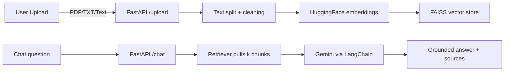

# AskMyPdf

AskMyPdf lets you upload a PDF, a `.txt` file, or paste raw text and then chat with the document. The FastAPI backend builds an in-memory FAISS vector store per upload, and the Next.js frontend provides a modern chat surface powered by Gemini via LangChain.

## Features

- 📄 **Multi-source ingestion** – upload PDF/TXT files or paste paragraphs of text.
- ⚡ **Warm document cache** – each upload replaces the current FAISS store for snappy follow-up questions.
- 💬 **Chat-style UI** – conversational history with cited sources for every answer.
- 🔐 **Configurable endpoints** – point the frontend at any backend with `NEXT_PUBLIC_BACKEND_URL`.

## Requirements

- Python 3.11
- Node.js 18+
- Google Generative AI key with access to `gemini-2.0-flash-lite`

## Environment Variables

| Name | Scope | Purpose |
| --- | --- | --- |
| `GOOGLE_API_KEY` | backend `.env` | Auth token for `langchain_google_genai`. Required for answering questions. |
| `NEXT_PUBLIC_BACKEND_URL` | frontend `.env.local` | Optional override (defaults to `http://127.0.0.1:8000`). Provide only the base URL. |

> Keep your `.env` files private. `.gitignore` already excludes them.

## Project Structure

```
backend/
  main.py          # FastAPI app exposing /upload and /chat
  rag.py           # PDF/Text ingestion + LangChain pipeline
frontend/pdf_chatbot/
  app/page.tsx     # Chat UI
  app/layout.tsx   # Next.js root layout
  globals.css      # Styling
```

## Screenshots


*Document upload + chat interface running locally.*


*Backend OpenAPI docs showing the `/upload` and `/chat` endpoints.*

## How it works



1. `/upload` normalizes the document, chunks it, and writes the vectors into an in-memory FAISS store keyed to the session.
2. `/chat` retrieves the top-k chunks for a question, hands them to Gemini with a guarded prompt, and returns both the answer and the chunk references.

## Getting Started

### 1. Backend (FastAPI + LangChain)

```bash
conda activate langchain-env
pip install -r backend/requirements.txt
uvicorn backend.main:app --reload
```

The API runs at `http://127.0.0.1:8000`. Use `/docs` for interactive testing.

### 2. Frontend (Next.js)

```bash
cd frontend/pdf_chatbot
npm install
npm run dev
```

Visit `http://localhost:3000`, upload a document, and start chatting.

## API Reference

| Method | Route | Body | Description |
| --- | --- | --- | --- |
| `POST` | `/upload` | `pdf_file` *or* `txt_file` *or* `plain_text` | Builds a FAISS store from a PDF/TXT upload or pasted text. Returns `{ document_id }`. |
| `POST` | `/chat` | `{ "question": "...", "document_id": null }` | Retrieves answers grounded in the indexed document. If `document_id` is omitted, the latest upload is used. |

Errors are returned as JSON with descriptive messages. Supply exactly one source per `/upload` call; whitespace-only text is rejected.

## Example requests

### Upload a PDF via curl

```bash
curl -X POST "http://127.0.0.1:8000/upload" \
  -H "Authorization: Bearer $GOOGLE_API_KEY" \
  -F "pdf_file=@sample.pdf"
```

### Ask a follow-up question from the frontend

```tsx
const response = await fetch(`${BACKEND_URL}/chat`, {
  method: "POST",
  headers: { "Content-Type": "application/json" },
  body: JSON.stringify({
    question: "What are the main findings?",
    document_id: null,
  }),
});
const data = await response.json();
setAnswer(data.answer);
```

## Tips & Troubleshooting

- Ensure `GOOGLE_API_KEY` is set before starting the backend, otherwise Gemini will raise authentication errors.
- The backend currently caches only one document at a time; uploading a new file replaces the previous FAISS store.
- Large PDFs may take a few seconds to chunk and embed—watch backend logs for progress.
- When deploying, run `uvicorn backend.main:app --host 0.0.0.0 --port 8000` behind a reverse proxy and set the frontend `NEXT_PUBLIC_BACKEND_URL` accordingly.

---

Contributions are welcome—feel free to open issues or pull requests if you extend the pipeline.
